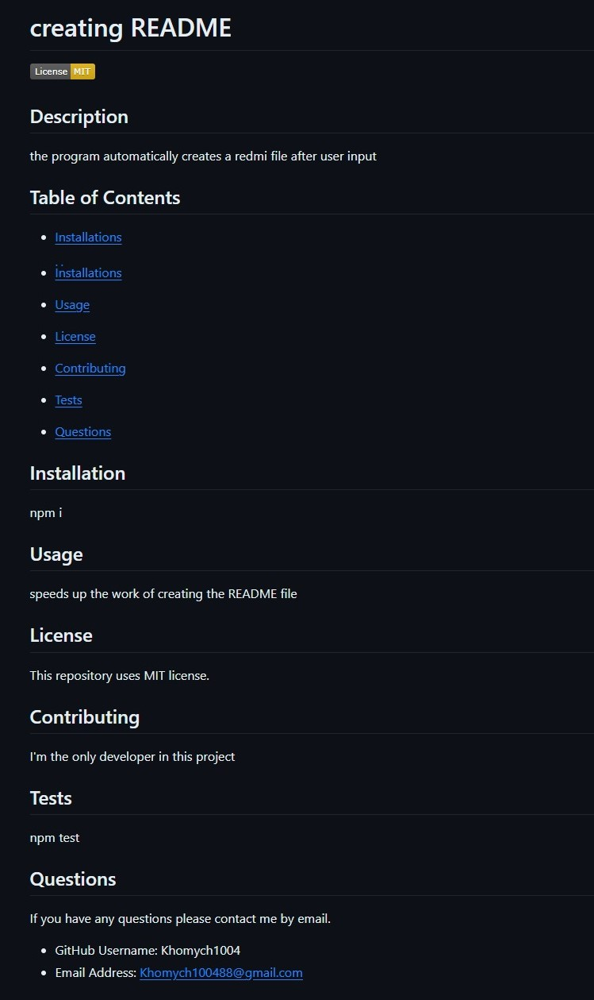

# creating_redme



## Description
The application is designed to automatically create a README file based on user input

## Usage
```
required for use

download source code
use npm i
run the application in the terminal with the command node index.js

```
you can watch the video demonstration at the link -> [here](created_readme/avi.mp4)

## Credits

To create the application, I used resources on:
[MDN Web Docs](https://developer.mozilla.org)
||
[GitHub Docs](https://docs.github.com)
||
[W3Schools](https://www.w3schools.com/)
||
[GeeksforGeeks](https://www.geeksforgeeks.org/)
